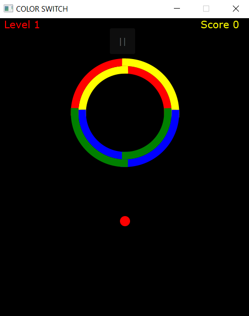
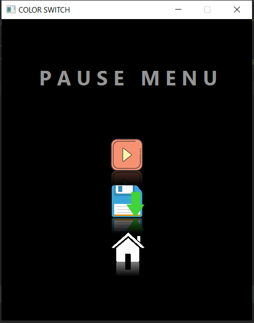

# Color-Switch 

Developed a replica of the Color Switch game with various new
obstacles and increasing difficulty level as the game progresses.

In this project, various features have been included, such as -

- Fluid animation
- Object Collision
- Saving the game
- Multiple levels which increases difficulty
- Saving the game
- Resuming the game
- Once out, gets another chance to continue at the price of 5 coins.

Actual Game video Link - https://www.youtube.com/watch?v=-KV35ZXSW8s&t=197s

## How to run this game on your device?

In order to run this code on intellij follow following steps -

Firstly, install javafx SDK :-
[javafx SDK](https://gluonhq.com/products/javafx/)

Then got to FILE -> Project Structure -> Libraries then click on plus(+) icon then add javafx-sdk (Place where it is downloaded)

Adding in VM/Ubuntu options -

--module-path "C:\javafx-sdk-15.0.1\lib" --add-modules javafx.controls,javafx.media,javafx.fxml

## Documentation

[Project-Documentation](https://drive.google.com/file/d/1lc2sT99fbwa2PvFth94Ht7W8L2emUxGx/view?usp=sharing)

  
## Demo

  
  
  

  
  
  

  
  
  

  
  
  

  
  
  

  
## 🛠 Tech Stack
- Java
- JavaFX
- SceneBuilder
- Git

  
## Authors

- [@Jasdeep](https://github.com/Jassi-71)
- [@Rohit](https://github.com/rohit18259)

  
